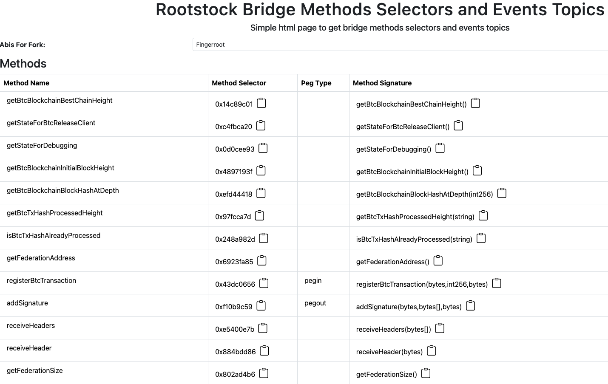
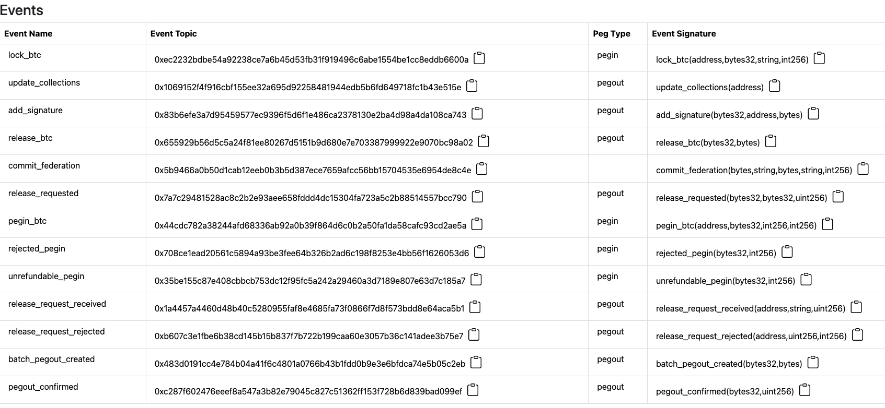
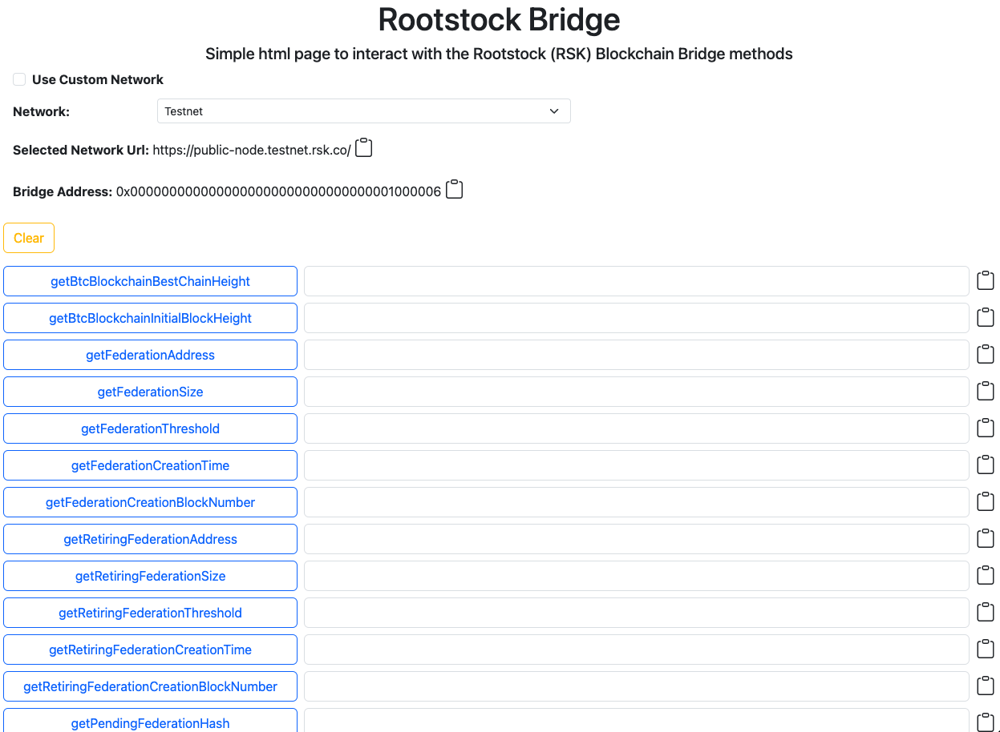

[](https://github.com/rsksmart/precompiled-abis/actions?query=workflow%3ACodeQL)
[](https://scorecard.dev/viewer/?uri=github.com/rsksmart/precompiled-abis)


# Welcome to the precompiled ABIs from Rootstock

Here you will find the ABIs for the existing precompiled contracts in Rootstock. You will also get their addresses.

# Version

Different versions of the package mentioned are required for different Rootstock releases.

Until Fingerroot, the semantic versioning of this package doesn’t correlate to the semantic versioning of Rootstock. For each named release of Rootstock, there will be a corresponding name version in npm.

This package's support starts with ORCHID.

# How to use it

For the installation of these package you must execute in a terminal window:

```shell
npm install @rsksmart/rsk-precompiled-abis@<version>
```

## With Ethers

```js

const ethers = require('ethers');
const precompiledAbis = require('@rsksmart/rsk-precompiled-abis');
const networkUrl = 'https://public-node.rsk.co/';

const provider = new ethers.JsonRpcProvider(networkUrl);
const bridge = new ethers.Contract(precompiledAbis.bridge.address, precompiledAbis.bridge.abi, provider);

bridge.getBtcBlockchainBestChainHeight().then(console.log);

```

That would print something like: `881524n`.

## With Viem

```js
const { createPublicClient, http } = require("viem");
const { mainnet } = require("viem/chains");
const precompiledAbis = require('@rsksmart/rsk-precompiled-abis');
const networkUrl = 'https://public-node.rsk.co/';

const client = createPublicClient({
  chain: mainnet,
  transport: http(networkUrl),
});

const getBlockchainHeight = async () => {
  try {
    const height = await client.readContract({
      address: precompiledAbis.bridge.address,
      abi: precompiledAbis.bridge.abi,
      functionName: "getBtcBlockchainBestChainHeight",
    });
    console.log("btcBlockchainBestChainHeight:", height);
  } catch (error) {
    console.error("Error getting btcBlockchainBestChainHeight:", error);
  }
};

getBlockchainHeight();

```

That would print something like: `881524n`.

# Important note

If the version to be installed is not defined in the command line, it will install the latest version by default.

# Versioning table

| Package Version  | RSK version      |
|------------------|------------------|
| 1.0.0-ORCHID     | ORCHID-0.6.2     |
| 2.0.0-WASABI     | WASABI-1.0.0     |
| 2.0.1-WASABI     | WASABI-1.0.0     |
| 3.0.0-PAPYRUS    | PAPYRUS-2.0.0    |
| 4.0.0-IRIS       | IRIS-3.0.0       |
| 4.0.2-IRIS       | IRIS-3.0.0       |
| 5.0.0-HOP        | HOP-4.0.0        |
| 5.0.0-FINGERROOT | FINGERROOT-5.0.0 |
| 6.0.0-ARROWHEAD  | ARROWHEAD-6.0.0  |
| 7.0.0-LOVELL     | LOVELL-7.0.0     |
| 8.0.0-REED       | REED-8.0.0       |

# Rootstock Bridge Methods Selectors and Events Topics page

A standalone HTML project to get the RSK bridge methods selectors and events topics is included under `/tools` folder, called `PrecompiledAbis.html`.

Simply download it and open it in the browser, or visit [https://rsksmart.github.io/precompiled-abis/](https://rsksmart.github.io/precompiled-abis/) to view the available HTML tools directly from this repo.





You can see the rsk bridge abi methods and events during a given fork by selecting using the ***Abis For Fork*** dropdown.

# RootstockBridge HTML utility page

A standalone HTML project to interact with the RSK bridge methods is included under `/tools` folder, called `RootstockBridge.html`.

Simply download it and open it in the browser.

It will look like this:



Simply click on any of the buttons with the name of the Bridge method that you want to call.

For the ones that accept input, simply add the inputs required and click the button.

Change the network from Testnet to Mainnet using the **Network** select at the top of the page.

Clear all the inputs and results clicking on the **Clear** button.

Copy the result by clicking on the copy icon to the right of the result box.

To use a custom network, click on `Use Custom Network` checkbox and you will have a text field to input a custom url. Hit enter/return and use the tool as usual.

For any comments or suggestions, feel free to contribute or reach out at our [Discord server](https://discord.gg/rootstock).
